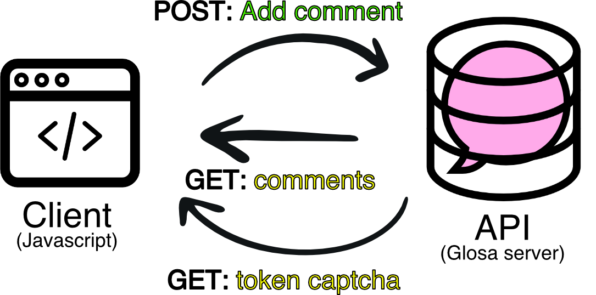
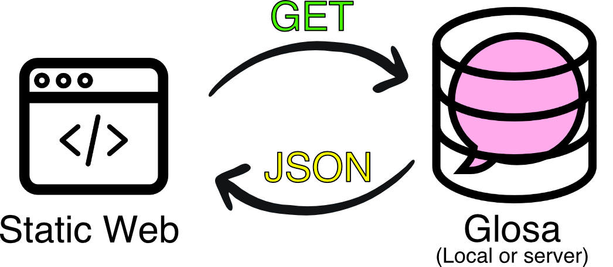
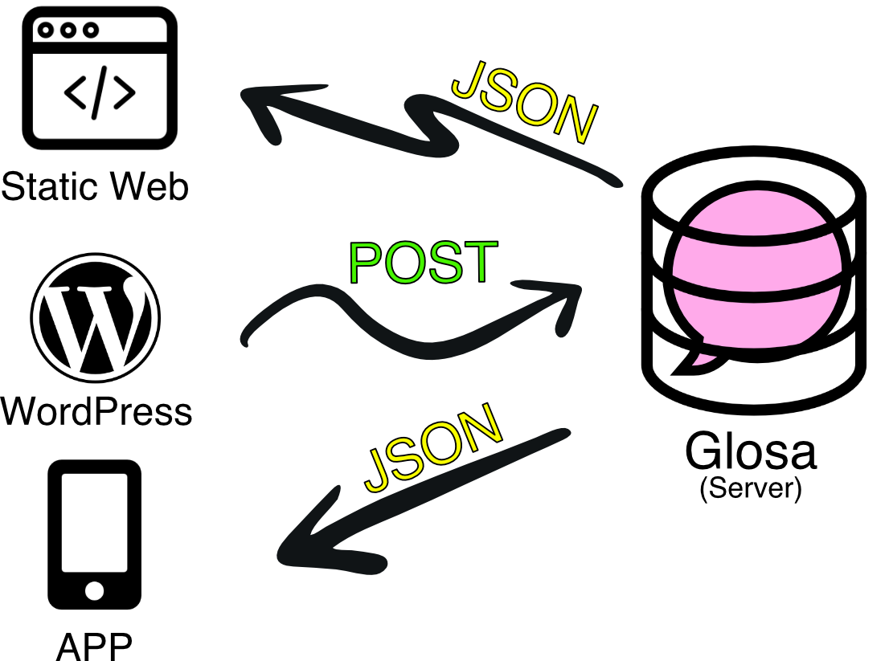
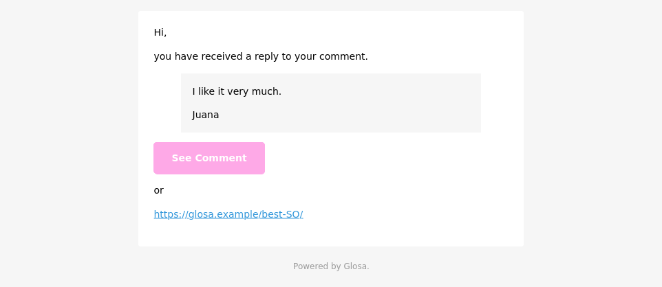

<p align="center">
   
</p>
<h1 align="center">Glosa: Comments for static sites.</h1>
<p align="center">
   <strong >Clone of Disqus, but faster, Opensource and sexy.</strong>
</p>

## Amazing reasons to use it

- **Opensource**.
- **Very fast**, responses between 5ms and 15ms on average.
- Easy to integrate with **static pages**.
- **APP for desktop, mobile and terminal** to manage comments: Delete, update, reply...
- **Easy to import** from Disqus.
- **No database**, everything is stored in a JSON.
- Configuration in a **simple YAML**.
- **Captcha** system included.
- **Receive an email** for each new comment.
- **Users are notified** by email if they are answered.
- **Multisite**: Single server for multiple websites.

## [Video Demo](https://cdn.jsdelivr.net/gh/glosa/glosa-static-integration/media/demo.mp4)

## [Example connect with your static site (only HTML and Javascript)](https://github.com/glosa/glosa-static-integration)

## [Import your comments from Disqus](https://github.com/glosa/glosa-disqus-import)

---

## Use it now

- [How does it work?](#how-does-it-work)
- [Origin](#origin)
- [Run](#run)
- [Notification template for email](#notification-template-for-email)
- [API](#api)
- [Terminal cli](#terminal-cli)
- [Deployment](#deployment)
- [Create your own JAR](#create-your-own-jar)

---

## How does it work?

<p align="center">
   
</p>

On the one hand we have Glosa who would be our comment server. It **feeds in GET and POST requests**, and obediently **returns JSON**. It can only return **comments from a url** (it sorts comments by url, not ids) or **create a new comment** (**parent or child** of another comment). Nothing else. If you want to create a comment previously you will need to ask for the token to confirm that you are not a robot.

**Optionally you can receive an email** automatically when a new comment is written.

The website, CMS or mobile application, must integrate a **logic with Javascript** to make the necessary requests and render the comments properly. To make this task easier we have created an example template that you can modify to your needs. You can find the link on this page.

## Scenarios

### 1 web page, share or not a server

<p align="center">
   
</p>

### 3 web pages in different domains or servers

<p align="center">
   
</p>


## Origin

A Glosa is a **Spanish word**. It is defined as a **note**, usually brief, that is **written in the margin of a text** or even between its lines with the intention of clarifying some idea of it. 

The software was born with the **intention that the author's static blog would no longer depend on an external company** (Disqus), and could have control of its content. To make it as easy as possible to deploy, develop and maintain; he programmed in **Clojure**. And from the beginning it was clear to him that he didn't need a conventional database, **plain text was enough**.

## Run

1) Make sure you have Java installed.

Debian/Ubuntu

``` sh
sudo apt install default-jre
```

Mac OS

``` sh
brew install java
```

2) Create a file `config.yaml` with the following content. You can also use `config.yaml.example` as a base config and change it to fit your needs.

``` yaml
##### General #####
# If it is active it will be accessible to any client
debug: false
# It can be a domain in case of using a proxy: example.com
domain: localhost
port: 4000
# Access for APP
token: mysecret
# It indicates which domain can use it. Debug true so there are no limitations.
domain-cli: "http://example-cli.com/"

##### Notify #####
# Type of notification, currently valid: email
notify: email
subject: New comment
from: server@example.com
admin: user@example.com
# SMTP, only notify: email
smtp-host: smtp.example.com
smtp-user: smtpuser
smtp-password: smtppassword
smtp-port: 25
smtp-tls: true

##### Captcha #####
# Currently valid: time
captcha: time

##### Database #####
# Currently valid: plain
database: plain
```

3) Download the latest version of Glosa (`glosa-{version}-standalone.jar`).

https://github.com/glosa/glosa-server/releases


4) Now you can execute glosa.

```sh
java -jar target/glosa-{version}-standalone.jar
```

Great 🎉. You already have your 🔥 own comment server 🔥.

That's it, now you just have to test that it works properly.

``` sh
curl localhost:4000/api/v1/captcha/
```

It will return a random token

``` json
{"token":"OABWNONEOOKXRMMWADPF"}
```

## Notification template for email

The first time Glosa is run it will create an HTML template with the name `template-email.html`. Edit freely.

<p align="center">
   
</p>

---

## Public API

No `token** is required to interact. 

### - Get Comments

Gets all the comments on one page.

**Method**: `GET`

``` sh
/api/v1/comments/?url={url}
```

| Param | Value  | Description |
|---|---|---|
| url  | string | Page where you want to get the comments. |

#### Example

Get from `https://glosa.example/best-SO/`.

``` sh
curl 'https://programadorwebvalencia.localhost:4000/api/v1/comments/?url=https://glosa.example/best-SO/'
```

#### Success response

``` json
[
    {
        "id": 4812781236,
        "parent": "",
        "deep": 0,
        "createdAt": 1584266634,
        "thread": "https://glosa.example/best-SO/",
        "author": "Lexar",
        "email": "",
        "message": "Do you use Glosa too? It's an amazing technology."
    },
    {
        "id": 4812781237,
        "parent": "4812781236",
        "deep": 1,
        "createdAt": 1584266746,
        "thread": "https://glosa.example/best-SO/",
        "author": "Lucia",
        "email": "lucia@my.email",
        "message": "I love the article."
    }
]
```

#### Fail response

``` json
[]
```

### - Add Comment

Add new comment on one page. After saving the comment the token will no longer be valid. At the same time a notification (email) will be sent to the administrator (in the configuration it is called `admin`), in case it is a sub-comment it will also be sent another notification to the parent of the comment if the address is present.


**Method**: `POST`

``` sh
/api/v1/comments/
```

| Param | Value | Description |
|---|---|---|
| parent  | number | If it's a sub-comment, the number of the parent comment. Otherwise leave empty. |
| author  | string | Author's name. |
| email  | string | Email that the user will be notified of the responses to his comment. Leave blank if not desired. |
| message  | string | Message. It can be HTML or plain. |
| token  | number | Number of the token generated by the captcha endpoint. |
| thread  | string | Page where you want to save the comment. |

#### Example

Save comment from `https://glosa.example/best-SO/`.

``` sh
curl -XPOST -H "Content-type: application/json" -d '{
	"parent": "",
	"token": "VRJUOBBMTKFQUAFZOKJG",
	"author": "Juana",
    "email": "juana@my.email",
	"message": "I like it very much.",
	"thread":"https://glosa.example/best-SO/"
}' 'https://glosa.example:4000/api/v1/comments/'
```

#### Success response

``` json
{
    "status": 200
}
```

#### Fail response


``` json
{
    "status": 401
}
```

### - Get captcha token

Get a token to validate that a new comment can be created. It has only one use. It must also be obtained 20 seconds before use or it will not work.

**Method**: `GET`

``` sh
/api/v1/captcha/?url={url}
```

| Param | Value  | Description |
|---|---|---|
| url  | string | Page where you want to save the comment. |

#### Example

Get token for page `https://glosa.example/best-SO/`.

``` sh
curl 'https://glosa.example:4000/api/v1/captcha/?url=https://glosa.example/best-SO/'
```

#### Success response

``` json
{
    "token": "ZRFOKXLALKNPOJPYJLVY"
}
```

#### Fail response


``` json
{
    "token": ""
}
```

### - Check if he is alive

Simple answer to check that the service is working.

**Method**: `GET`

``` sh
/api/v1/ping/
```

#### Example

``` sh
curl 'https://glosa.example:4000/api/v1/ping/'
```

#### Success response

``` json
{
    "ping": "pong"
}
```

## Private API

You need a `token` to be able to interact (You will find it in your `config.yaml`). Use a **header with Bearer authorization** on each request.

Example with `mysecret` token.

``` sh
curl -XDELETE -H "Authorization: Bearer mysecret" -H "Content-type: application/json" ...
```
### - Update Comment

Update a comment for ID.

**Method**: `PUT`

``` sh
/api/v1/comments/
```

| Param | Value | Description |
|---|---|---|
| id  | number | Comment ID. |
| author  | string | Author's name. |
| email  | string | Email that the user will be notified of the responses to his comment. Leave blank if not desired. |
| message  | string | Message. It can be HTML or plain. |


#### Example

Update comment from `https://glosa.example/api/v1/comments/1234`.

``` sh
curl -XPUT -H "Authorization: Bearer mysecret" -H "Content-type: application/json" -d '{
    "id": 1234
    "author": "Alex",
    "email": "alex@my.email",
    "message": "I love the article."
}' 'https://glosa.example:4000/api/v1/comments/
```

#### Success response

``` json
{
  "updated": true,
  "id": 1234
}
```

#### Fail response


``` json
{
  "updated": false,
  "id": 1234
}
```


### - Delete Comment

Delete a comment for ID.

**Method**: `DELETE`

``` sh
/api/v1/comments/
```

| Param | Value | Description |
|---|---|---|
| id  | number | Comment ID. |

#### Example

Delete comment from `https://glosa.example/api/v1/comments/1234`.

``` sh
curl -XDELETE -H "Authorization: Bearer mysecret" -H "Content-type: application/json" -d '{
    "id": 1234
}' 'https://glosa.example:4000/api/v1/comments/
```

#### Success response

``` json
{
  "deleted": true,
  "id": 1234
}
```

#### Fail response


``` json
{
  "deleted": false,
  "id": 1234
}
```
### - Search Threads

Search for all urls containing a certain string ignoring uppercase.

**Method**: `GET`

``` sh
/api/threads/search/{query}
```

| Param | Value | Description |
|---|---|---|
| query  | string | String to search. |

#### Example

Search all threads with  `tadam`.

``` sh
curl -H "Authorization: Bearer mysecret" 'https://glosa.example:4000/api/threads/search/tadam'
```

#### Success response

``` json
[
  {
    "thread": "https://my.blog/tadam-vs-pedestal/"
  },
  {
    "thread": "https://my.blog/best-web-framework-clojure-tadam"
  }
]
```

#### Fail response


``` json
[]
```

---

## Terminal cli

To **manage some minor features** you can use the `manager` script which will filter, modify or delete the database. Previously **remember to stop Glosa** to avoid problems.

You will need to have **Node installed** on your computer and give it **permission to run**.

### Last comments

``` sh
./manager last [number of elements]
```

Example

``` sh
./manager last 3
```

### Take all comments by thread

``` sh
./manager get [thread]
```

Example

``` sh
./manager get https://glosa.example/best-SO/
```

### Update the text of a comment

``` sh
./manager update [id] [new message]
```

Example

``` sh
./manager update 1234 'I love your article.'
```

### Delete a comment

``` sh
./manager delete [id]
```

Example

``` sh
./manager delete 1234
```

## Deployment

With Nginx it's pretty quick and easy. You can use it as a reverse proxy, since Glosa contains its own web server (Jetty). You can see an example of configuration that can be useful.

### Nginx

``` nginx
server {        

        server_name glosa.domain.com;

        access_log /var/log/glosa_access.log;
        error_log /var/log/glosa_error.log;

        location / {
            proxy_pass http://localhost:4000/;
            proxy_set_header Host $http_host;
            proxy_set_header X-Forwarded-For $proxy_add_x_forwarded_for;
            proxy_set_header X-Forwarded-Proto $scheme;
            proxy_redirect  off;
        }
}
```

### Systemctl

To create a service in Linux is done like any application in Java. Below you can see an example.

Create a file in the following path: `/etc/systemd/system/glosa.service`

Add the content.

``` Systemctl
[Unit]
Description=Glosa
After=network.target

[Service]
Type=simple
Restart=always
WorkingDirectory=/folder/jar/
ExecStart=java -jar glosa.jar

[Install]
WantedBy=multi-user.target 
```

Finally enable and start the service.

``` sh
sudo systemctl enable glosa
sudo systemctl start glosa
```

## Create your own JAR

1) Make sure you have **openjdk** or **oracle-jdk** installed, **clojure** and  **leiningen**.

### MacOS

``` sh
brew install openjdk clojure leiningen
```

### Debian/Ubuntu

``` sh
sudo apt install default-jdk clojure leiningen
```

2) Clone the repository and enter the generated folder.

``` sh
git clone https://github.com/glosa/glosa-server.git
cd glosa-server
```

3) Run the following command to build a `jar` file.

`lein uberjar`

After this two files should be created in `target/`. We will use the standalone version: `glosa-{version}-standalone.jar`.

---

## Dev tools

It needs to be executed at the root of the project and have `Leiningen` installed.

### Lint

It checks linguistically and syntaxically if the code is correct.

``` shell
make lint
```

### Build

Build a JAR ready to distribute.

``` shell
make build
```

### Deploy

Distributed in Clojars.

``` shell
make deploy
```

---

<p align="center">
  Thanks to the power of <a href="https://www.tadam-framework.dev/"> Tadam Framework</a>
</p>
